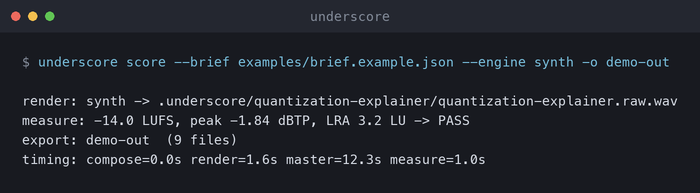

# Underscore

Underscore makes background music for developer videos. You give it a short brief, or a video, and it returns a finished music bed: mastered to broadcast loudness, measured against what you asked for, and dedicated to the public domain. Every track ships with the source code that produced it, so anyone can regenerate or change it.



It runs on your own machine with your own accounts. Nothing is hosted. The audio never leaves your computer, and in brief mode nothing else does either.

## Why it exists

Developer relations and content teams publish a steady stream of videos, and most of them need music under the voice. Commercial stock libraries come with license terms that many companies will not accept for published material, and reviewing each track's terms takes time nobody has. The usual result is silence, or the same three approved tracks in every video.

Underscore takes a different route. The music is written as code by a language model working from your brief, rendered on your hardware by Sonic Pi, mastered and checked by the pipeline, and released under CC0. A track made this way has no license terms for anyone to review. You can use it, your employer can use it, and so can anyone else.

## What you get

Each bed is one folder:

| File | Purpose |
|---|---|
| `title.master.wav` | The finished bed, 48 kHz, 24-bit, -14 LUFS, with fades. |
| `title.ducked.wav` | Only when the brief has speech spans: the same bed with volume automation baked in under them. Drop it under a voice track and it already sits in the right place. |
| `title.stem-*.wav` | Separate instrument layers, when the engine produces them. |
| `title.preview.mp3` | A small file for auditioning. |
| `title.rb` | The Sonic Pi program. The code is the score. |
| `markers.csv`, `markers.edl` | Section and hit markers for the editing timeline. |
| `brief.json` | Exactly what the generator was asked for. |
| `manifest.json` | Seed, engine, every measurement, and the gate result. |
| `gates.json` | The gate result in the family's shared report shape (the same file Galley and Backdrop write). |
| `LICENSE-CC0.txt` | The public domain dedication. |

The dedication also travels inside the audio: every WAV carries a Broadcast Wave `bext` chunk and the MP3 carries ID3 tags, each naming the bed, the CC0 license URL, and the sha256 of `manifest.json`, so a file separated from its folder still says what it is and what it may be used for.

## How it works

The pipeline has six stages. Each one is a command, and `underscore score` runs them all.

1. **Analyze** (video mode only). Scene cuts are detected with PySceneDetect. Speech is located with faster-whisper, and its timestamps become the speech map; WebRTC VAD is the fallback when there is no transcript. A tempo is chosen so that bar lines land near the scene cuts. The result is a brief. This stage runs entirely on your machine.
2. **Compose.** The brief is turned into a prompt, and a language model writes Sonic Pi code: one function per section, one per hit, all in key, built from an allowed set of synths and samples. The model is yours, reached through one of three seams: a command-line agent you already run, a chat-completions HTTP endpoint, or a local model runner (see Backends). The code is validated (required functions present, no forbidden constructs, no helper names that collide with Sonic Pi's own API) and wrapped in a fixed outer program that sets tempo and seed and sequences the sections to an exact number of bars. With `--engine audiogen`, this step is skipped entirely (see Audiogen below).
3. **Render.** Sonic Pi 5 plays the program headlessly and records it. Rendering happens in real time: a 90 second bed takes about 90 seconds plus boot. A built-in synth engine can stand in when Sonic Pi is not available, so the rest of the pipeline stays testable. If Sonic Pi reports a runtime error, the errors are handed back to the model and the program is composed again once before the run is declared a failure. With `--engine audiogen`, a text-to-music model generates audio directly from the brief, skipping both compose and Sonic Pi.
4. **Master.** A gentle chain (high-pass, compression, two shelves, light reverb), loudness normalization to the brief's target, a transparent peak limiter with true-peak headroom, and fades. With a reference track and `matchering` installed, the tonal balance is matched to the reference.
5. **Measure.** Integrated loudness, true peak, loudness range, spectral centroid, and per-section onset density are computed. The gate refuses a bed whose loudness misses the target by more than 1 LU, whose true peak exceeds -1 dBTP, whose length is wrong, whose sections are silent, or whose energy curve does not follow the brief.
6. **Export.** The bundle above is written. Beds that fail the gate are still written for inspection, but the manifest marks them as not shippable and the catalog page leaves them out.

## Two ways to start

**Brief mode.** You describe the music: duration, tempo, key, sections with a mood and an energy level, optional hit points, optional speech spans. `underscore init` writes a starter brief to edit. Nothing about your video is involved.

**Video mode.** You point Underscore at a video. It derives the brief from the cuts and the speech, so the music changes where the picture changes and gets out of the way when someone is talking. With a language model backend, the transcript is used to assign moods and place hits. With `--offline-brief`, a heuristic does that instead and no model is called.

## Quick start

On Debian or Ubuntu, install two system packages first: `pedalboard` needs `libatomic.so.1`, and the MP3 preview and video mode need `ffmpeg` and `ffprobe` (the `ffmpeg` package provides both). Prefix with `sudo` if you are not root.

```bash
apt-get install -y -qq libatomic1 ffmpeg >/dev/null
```

On macOS:

<!-- rot: skip -->
```bash
brew install --cask sonic-pi   # required for real renders
brew install ffmpeg
```

Then install and run the pipeline. The built-in synth engine needs no model and no Sonic Pi, so this works anywhere:

```bash
python3 -m venv .venv && . .venv/bin/activate
pip install -e '.[video]'

underscore init my-video --duration 90                        # writes my-video.brief.json
underscore score --brief my-video.brief.json --engine synth   # full pipeline, bundle in out/my-video
```

With Sonic Pi and a composing backend installed, drop `--engine synth` for real music, or start from a video:

<!-- rot: skip -->
```bash
underscore score --brief my-video.brief.json  # compose with a model, render with Sonic Pi
underscore score --video talk.mp4             # video mode
underscore score --video talk.mp4 --offline-brief --llm local   # nothing leaves the machine
```

Individual stages are available as `analyze`, `compose`, `render`, `master`, and `measure`. `underscore doctor` reports whether this machine can render with Sonic Pi and which composing backends are configured.

For music that repeats cleanly, `underscore score --loop` produces a tileable bed: no fades, the seam crossfaded so the last moment flows into the first, and the gate checks the tile point. The bed comes out half a second shorter than the brief (the crossfade), and the manifest records `loop: true`.

Sonic Pi is looked for at `/Applications/Sonic Pi.app`; point `UNDERSCORE_SONIC_PI_APP` (or `--sonic-pi-app`) somewhere else to override. The headless render is verified on macOS only; on Linux the override exists but the Sonic Pi 5 layout there is unverified, and the synth engine is the supported path.

## Requirements

- Python 3.10 or newer.
- **Sonic Pi 5.0 or newer, installed in `/Applications`, is a hard requirement for real renders.** The render is realtime and audible: a 90 second bed takes about 90 seconds of playback plus boot. Renders are macOS only today; on Linux the built-in synth engine runs the whole pipeline instead, and the Sonic Pi paths in `render.py` are untested (see the roadmap).
- `ffmpeg` and `ffprobe` for MP3 previews and video mode (`brew install ffmpeg` on macOS; `apt-get install ffmpeg` on Debian and Ubuntu, which also needs `libatomic1` for the mastering chain).
- A composing backend for real music: any command-line agent, chat-completions endpoint, or local model runner you already use (see Backends below). Composing is the slowest stage, typically one to three minutes per bed. The synth engine skips it.
- Video mode downloads the faster-whisper `base` transcription model (about 75 MB) from the network on its first run and caches it; after that, analysis is fully local.

## Runs on your machine

Everything executes locally: analysis, rendering, mastering, measurement, and export. There is no service behind this project and no account with it. The one step that can touch a network is composing, and only through a seam you configure yourself: a command-line agent you already run, an HTTP endpoint you point it at, or a local model runner. With `--engine synth`, or with `--offline-brief` and a local runner, nothing leaves the machine at all.

## Backends

Underscore does not bundle a model or default to a vendor; it drives whatever you already have. Pick with `--llm`:

| Backend | How it runs | Configure |
|---|---|---|
| `cli` (default) | A command-line agent on this machine. The prompt goes to stdin; the generated code comes back on stdout. | `UNDERSCORE_CLI` holds the command, flags included. A literal `{model}` in it is replaced by `--model` or `UNDERSCORE_MODEL`. |
| `api` | A chat-completions style HTTP endpoint. | `UNDERSCORE_API_URL`, a model via `--model` or `UNDERSCORE_MODEL`, and optionally `UNDERSCORE_API_KEY` (sent as a bearer token). |
| `local` | The same command seam as `cli`, for a local model runner, so source material never leaves the machine. | `UNDERSCORE_LOCAL`, falling back to `UNDERSCORE_CLI`. |

For example, with a command-line agent that reads a prompt on stdin and prints its reply on stdout:

<!-- rot: skip -->
```bash
export UNDERSCORE_CLI="your-agent --print --plain"   # the agent command with its non-interactive flags
underscore score --brief my-video.brief.json
```

Any command that reads a prompt on stdin and prints the code on stdout works the same way, including local model runners.

## Audiogen: text-to-music, no Sonic Pi

The audiogen engine skips both the compose and Sonic Pi render steps. Instead, it converts your brief into a natural-language description of the music and sends it to a text-to-music model. The audio comes back and feeds into the same mastering, measurement, and export pipeline as every other engine.

This is the lowest-friction path: no Sonic Pi install, no LLM code generation, just a music model and a brief.

<!-- rot: skip -->
```bash
export UNDERSCORE_AUDIOGEN_URL="https://your-endpoint/v1/audio"
export UNDERSCORE_AUDIOGEN_KEY="your-key"

underscore score --brief my-video.brief.json --engine audiogen --collection drift
```

| Variable | Purpose |
|---|---|
| `UNDERSCORE_AUDIOGEN_URL` | HTTP endpoint that accepts a prompt and returns audio (HuggingFace Inference API, Replicate, or anything you self-host). |
| `UNDERSCORE_AUDIOGEN_KEY` | Bearer token, when the endpoint needs one. |
| `UNDERSCORE_AUDIOGEN_MODEL` | Model name, when the endpoint serves multiple. Falls back to `UNDERSCORE_MODEL`. |
| `UNDERSCORE_AUDIOGEN_CLI` | Alternative to the HTTP path: a CLI command called with `--output <path> --duration <seconds>`, prompt on stdin. |

The audiogen engine does not bundle or default to any model. You bring your own. If you need commercial-use rights (company videos, published content), choose a model whose license permits it: self-host a permissively licensed model on your own infrastructure, use a service with commercial terms, or train your own. Underscore does not care what is behind the endpoint; licensing is between you and your model provider.

The mastering chain, gate, and export work identically regardless of engine. A bed made with audiogen ships the same bundle: mastered WAV, preview MP3, measurements, manifest, and CC0 dedication.

## The Sonic Pi render, in detail

Sonic Pi 5 ships a headless boot library. `vendor/underscore-record.rb` builds on it: it starts the daemon and audio engine, begins recording through the spider (the same path the application's record button uses), runs the program for the brief's duration, saves the WAV, and shuts down. Two details matter. The engine pauses itself as soon as every run has completed, so the recorder keeps the run alive for several seconds past the end of the music. The first note can arrive a few seconds after recording starts on a fresh boot, so the recording window is longer than the brief and the pre-roll is trimmed afterwards.

Renders are audible while they run. The record tap sits before the output device, so the system volume does not change what is written.

## Reproducibility

Every bed records its seed, its brief, and its program. Re-rendering a program gives the same music. A real bed from the published catalog is checked in under `examples/reproduce/`; on a Mac with Sonic Pi installed, this regenerates the same music (the render is a realtime recording, so the file is not byte-identical, but every measurement matches):

<!-- rot: skip -->
```bash
underscore score --brief examples/reproduce/brief.json \
  --program examples/reproduce/deep-dive-amin-60s-1109.rb --engine sonicpi
```

Composing again from the same brief will produce different code, because the model is not deterministic. Keep the `.rb` file if you want the track back exactly.

## Data flow

| Stage | Brief mode | Video mode, cloud model | Video mode, `--offline-brief` or `--llm local` | `--engine audiogen` |
|---|---|---|---|---|
| Analyze | not used | cuts, transcript, speech map computed locally | same | not used (brief mode) or same (video mode) |
| Compose | brief text is sent to the model | brief plus transcript text and cut times are sent | nothing is sent | skipped |
| Render | local | local | local | music description prompt is sent to the audio model |
| Master, measure, export | local | local | local | local |

Audio, video frames, and finished tracks never leave the machine in any mode. With audiogen, a text description of the desired music is sent to the audio generation endpoint; no audio, video, or transcript data is included. If the source footage is confidential, use `--offline-brief` or `--llm local`.

## Using it at work

Most people who want this tool want it for company videos. `docs/POLICY.md` walks through the questions that come up: who owns the music, why the output is CC0, what a company actually receives, how the data is handled, and the practical rules that keep personal and company work separate. The short version: compose on your own time and hardware if you want to own the catalog, release it under CC0, and your employer uses it the way it would use any public domain library. Read your own company's policy; this project is not legal advice.

## Collections

A collection is a sonic world: its instruments, drum kit, effects, harmonic flavor, and arrangement signature. The same brief rendered in two collections sounds like two different libraries. Six ship today:

| Collection | Sound |
|---|---|
| analog | Warm analog pads and soft percussion. |
| glass | Bright, clean, and spacious; bells and piano with air between notes. |
| pulse | Driving electronic; pulsing bass, four on the floor when the energy allows. |
| ember | Lo-fi warmth with a gentle swing and a little vinyl texture. |
| drift | Cinematic ambient; long pads, sub bass, sparse pings. |
| orbit | Organic and friendly; kalimba, tonewheel organ, brushed percussion. |

Within a collection, each bed receives a deterministic instrument assignment from its seed, so eighteen beds in one world still differ from one another. Set `"collection"` in the brief, or pass `--collection` to the catalog script. Collections are defined in `src/underscore/collections.py`; adding one is a matter of listing its instruments and writing its sound in a paragraph.

## The catalog

`scripts/catalog.py` renders a matrix of beds (six profiles at 60, 90, and 120 seconds, rotating keys, fixed seeds) and `scripts/build_catalog_page.py` turns the results into a browsable page with players, measurements, and downloads. Failed beds are logged with their gate reasons and retried on the next run; if every bed in a run fails, the script exits non-zero.

A tiny demo of the same machinery, on the synth engine so it needs no model and no Sonic Pi:

```bash
.venv/bin/python scripts/catalog.py --out catalog-demo --collection glass --limit 2 --engine synth
.venv/bin/python scripts/build_catalog_page.py --catalog catalog-demo
```

The real catalog runs on Sonic Pi, one realtime render at a time (the full 108-bed matrix takes about 7 hours):

<!-- rot: skip -->
```bash
.venv/bin/python scripts/catalog.py --out catalog --collection glass --limit 18
.venv/bin/python scripts/build_catalog_page.py --catalog catalog   # groups by collection
```

## Project layout

```text
src/underscore/
  brief.py     bar arithmetic and derivation helpers over the shared brief schema
  _vendor/     the family's shared brief schema and gate report, vendored from rawlslab-core
  dedication.py  the CC0 dedication written into every WAV (bext) and MP3 (ID3)
  analyze.py   video -> brief (cuts, transcript, speech map)
  compose.py   brief -> Sonic Pi program (prompt, backends, validator, outer program)
  audiogen.py  brief -> audio via text-to-music model (no Sonic Pi, no compose)
  render.py    program -> WAV (Sonic Pi 5 headless, synth fallback, audiogen)
  master.py    mastering chain, loudness, limiter, fades, ducking
  measure.py   measurements and the gate
  export.py    the bundle, manifest, gates.json
  cli.py       the command line
  prompts/compose.md   the composing spec the model follows
  vendor/underscore-record.rb  the headless recorder
scripts/               catalog batch, catalog page + index, render check
tests/                 unit tests; the synth engine keeps them independent of Sonic Pi
```

## Twenty seconds of it

`docs/DEMO.md` is the shortest complete run: a starter brief, the whole pipeline on the synth engine, the gate's verdict read back. Rot replays it in a clean container on every push and records the run as `docs/demo.cast` (asciicast v2, 16 seconds), which any terminal player replays.

## Tests

```bash
pip install -e '.[dev]'
.venv/bin/python -m pytest -q tests
```

## Roadmap

- Stems from the Sonic Pi engine (one solo pass per layer).
- Linux paths for the Sonic Pi render.
- A published catalog page.

## License

Code: MIT. Music produced by the pipeline: CC0 1.0 (see `CATALOG-LICENSE.md`).

